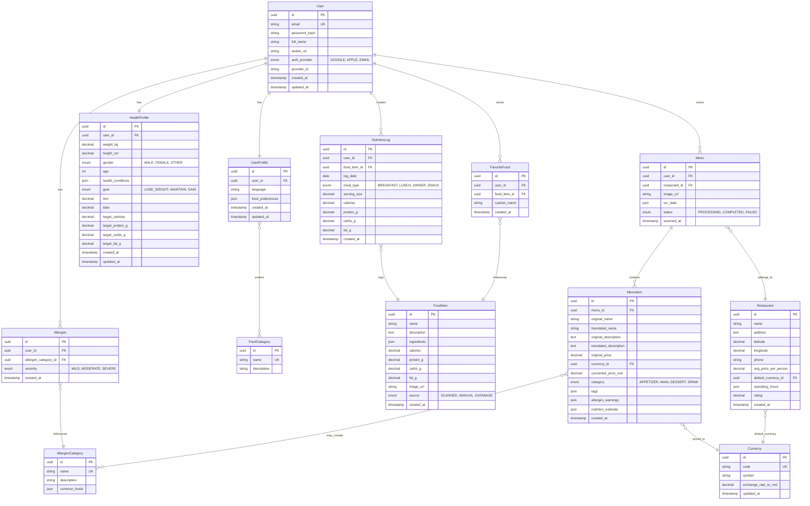

# ENTITY RELATIONSHIP DIAGRAM (ERD) - Ứng Dụng Dinh Dưỡng Thông Minh

## MỤC LỤC
1. [Tổng quan hệ thống](#1-tổng-quan-hệ-thống)
2. [Sơ đồ ERD](#2-sơ-đồ-erd)
3. [Chi tiết Entities](#3-chi-tiết-entities)
4. [Mối quan hệ (Relationships)](#4-mối-quan-hệ-relationships)

---

## 1. TỔNG QUAN HỆ THỐNG

Hệ thống quản lý 13 entities chính, được chia thành 5 nhóm:

### Nhóm 1: User & Authentication
- `User` - Tài khoản người dùng
- `UserProfile` - Thông tin cá nhân và preferences
- `HealthProfile` - Chỉ số sức khỏe và mục tiêu
- `Allergen` - Thông tin dị ứng của user

### Nhóm 2: Food & Nutrition
- `FoodItem` - Cơ sở dữ liệu món ăn
- `NutritionLog` - Nhật ký dinh dưỡng hằng ngày
- `FavoriteFood` - Món ăn yêu thích

### Nhóm 3: Menu & Restaurant
- `Menu` - Menu đã scan
- `MenuItem` - Món ăn trong menu
- `Restaurant` - Thông tin nhà hàng/địa điểm

### Nhóm 4: Reference Data
- `FoodCategory` - Danh mục sở thích món ăn
- `AllergenCategory` - Danh mục loại dị ứng
- `Currency` - Tỷ giá hối đoái

---

## 2. SƠ ĐỒ ERD



---

## 3. CHI TIẾT ENTITIES

### 3.1. User
**Mô tả:** Lưu trữ thông tin tài khoản người dùng

| Column | Type | Constraints | Description |
|--------|------|-------------|-------------|
| id | UUID | PRIMARY KEY | Unique identifier |
| email | VARCHAR(255) | UNIQUE, NOT NULL | Email đăng nhập |
| password_hash | VARCHAR(255) | NULLABLE | Hash password (null nếu OAuth) |
| full_name | VARCHAR(255) | NOT NULL | Họ và tên |
| avatar_url | TEXT | NULLABLE | URL avatar |
| auth_provider | ENUM | NOT NULL | GOOGLE, APPLE, EMAIL |
| provider_id | VARCHAR(255) | NULLABLE | ID từ OAuth provider |
| created_at | TIMESTAMP | NOT NULL | Thời gian tạo |
| updated_at | TIMESTAMP | NOT NULL | Thời gian cập nhật |

**Indexes:**
- PRIMARY: `id`
- UNIQUE: `email`
- INDEX: `auth_provider`, `provider_id`

---

### 3.2. UserProfile
**Mô tả:** Thông tin cá nhân và preferences của user

| Column | Type | Constraints | Description |
|--------|------|-------------|-------------|
| id | UUID | PRIMARY KEY | Unique identifier |
| user_id | UUID | FOREIGN KEY, UNIQUE, NOT NULL | Tham chiếu User.id |
| language | VARCHAR(10) | NOT NULL, DEFAULT 'vi' | Ngôn ngữ: vi, en, ja, ko, th |
| food_preferences | JSONB | NULLABLE | Array of FoodCategory IDs |
| created_at | TIMESTAMP | NOT NULL | Thời gian tạo |
| updated_at | TIMESTAMP | NOT NULL | Thời gian cập nhật |

**Indexes:**
- PRIMARY: `id`
- FOREIGN KEY: `user_id` -> `User.id` (ON DELETE CASCADE)
- UNIQUE: `user_id`

**Sample JSON (food_preferences):**
```json
{
  "category_ids": ["uuid-1", "uuid-2"],
  "tags": ["Vegan", "Halal", "Asian Food"]
}
```

---

### 3.3. HealthProfile
**Mô tả:** Chỉ số sức khỏe, mục tiêu và macro targets

| Column | Type | Constraints | Description |
|--------|------|-------------|-------------|
| id | UUID | PRIMARY KEY | Unique identifier |
| user_id | UUID | FOREIGN KEY, UNIQUE, NOT NULL | Tham chiếu User.id |
| weight_kg | DECIMAL(5,2) | NOT NULL | Cân nặng (kg) |
| height_cm | DECIMAL(5,2) | NOT NULL | Chiều cao (cm) |
| gender | ENUM | NOT NULL | MALE, FEMALE, OTHER |
| age | INTEGER | NOT NULL | Tuổi |
| health_conditions | JSONB | NULLABLE | Array: Diabetes, HighBP, Cholesterol |
| goal | ENUM | NOT NULL | LOSE_WEIGHT, MAINTAIN, GAIN |
| bmi | DECIMAL(4,2) | COMPUTED | BMI = weight / (height/100)^2 |
| tdee | DECIMAL(6,2) | COMPUTED | Total Daily Energy Expenditure |
| target_calories | DECIMAL(6,2) | COMPUTED | Calories mục tiêu/ngày |
| target_protein_g | DECIMAL(5,2) | COMPUTED | Protein mục tiêu (g) |
| target_carbs_g | DECIMAL(5,2) | COMPUTED | Carbs mục tiêu (g) |
| target_fat_g | DECIMAL(5,2) | COMPUTED | Fat mục tiêu (g) |
| created_at | TIMESTAMP | NOT NULL | Thời gian tạo |
| updated_at | TIMESTAMP | NOT NULL | Thời gian cập nhật |

**Indexes:**
- PRIMARY: `id`
- FOREIGN KEY: `user_id` -> `User.id` (ON DELETE CASCADE)
- UNIQUE: `user_id`

**Sample JSON (health_conditions):**
```json
["Diabetes", "HighBP"]
```

**Business Logic:**
```
BMI = weight_kg / (height_cm / 100)^2

TDEE Calculation (Mifflin-St Jeor):
  Male: (10 × weight_kg) + (6.25 × height_cm) - (5 × age) + 5
  Female: (10 × weight_kg) + (6.25 × height_cm) - (5 × age) - 161
  Then multiply by activity factor (default 1.375)

Target Calories:
  LOSE_WEIGHT: TDEE - 500
  MAINTAIN: TDEE
  GAIN: TDEE + 300

Macro Distribution (default):
  Protein: 30% of calories / 4 = grams
  Carbs: 40% of calories / 4 = grams
  Fat: 30% of calories / 9 = grams
```

---

### 3.4. Allergen
**Mô tả:** Thông tin dị ứng của từng user

| Column | Type | Constraints | Description |
|--------|------|-------------|-------------|
| id | UUID | PRIMARY KEY | Unique identifier |
| user_id | UUID | FOREIGN KEY, NOT NULL | Tham chiếu User.id |
| allergen_category_id | UUID | FOREIGN KEY, NOT NULL | Tham chiếu AllergenCategory.id |
| severity | ENUM | NOT NULL | MILD, MODERATE, SEVERE |
| created_at | TIMESTAMP | NOT NULL | Thời gian tạo |

**Indexes:**
- PRIMARY: `id`
- FOREIGN KEY: `user_id` -> `User.id` (ON DELETE CASCADE)
- FOREIGN KEY: `allergen_category_id` -> `AllergenCategory.id`
- UNIQUE: (`user_id`, `allergen_category_id`)

---

### 3.5. AllergenCategory
**Mô tả:** Danh mục các loại dị ứng (master data)

| Column | Type | Constraints | Description |
|--------|------|-------------|-------------|
| id | UUID | PRIMARY KEY | Unique identifier |
| name | VARCHAR(100) | UNIQUE, NOT NULL | Tên loại dị ứng (vi) |
| description | TEXT | NULLABLE | Mô tả |
| common_foods | JSONB | NULLABLE | Danh sách món ăn thường chứa allergen này |

**Indexes:**
- PRIMARY: `id`
- UNIQUE: `name`

**Sample Data:**
```sql
INSERT INTO allergen_category (name, description, common_foods) VALUES
  ('Hải sản', 'Tôm, cua, cá, mực', '["Sushi", "Tempura", "Tom Yum"]'),
  ('Đậu phộng', 'Đậu phộng và các sản phẩm từ đậu phộng', '["Pad Thai", "Satay", "Kung Pao"]'),
  ('Gluten', 'Lúa mì, lúa mạch', '["Bánh mì", "Mì Ý", "Pizza"]'),
  ('Sữa', 'Sữa bò và sản phẩm từ sữa', '["Phô mai", "Kem", "Sữa chua"]'),
  ('Trứng', 'Trứng gà, vịt', '["Trứng chiên", "Bánh", "Mayonnaise"]');
```

---

### 3.6. FoodCategory
**Mô tả:** Danh mục sở thích ăn uống (master data)

| Column | Type | Constraints | Description |
|--------|------|-------------|-------------|
| id | UUID | PRIMARY KEY | Unique identifier |
| name | VARCHAR(100) | UNIQUE, NOT NULL | Tên category |
| description | TEXT | NULLABLE | Mô tả |

**Indexes:**
- PRIMARY: `id`
- UNIQUE: `name`

**Sample Data:**
```sql
INSERT INTO food_category (name, description) VALUES
  ('Vegan', 'Không chứa sản phẩm động vật'),
  ('Halal', 'Phù hợp với Hồi giáo'),
  ('Asian Food', 'Món ăn châu Á'),
  ('Mediterranean', 'Món ăn Địa Trung Hải'),
  ('Low-Carb', 'Ít tinh bột'),
  ('Keto', 'High Fat, Low Carb'),
  ('Vegetarian', 'Không ăn thịt');
```

---

### 3.7. FoodItem
**Mô tả:** Cơ sở dữ liệu món ăn

| Column | Type | Constraints | Description |
|--------|------|-------------|-------------|
| id | UUID | PRIMARY KEY | Unique identifier |
| name | VARCHAR(255) | NOT NULL | Tên món ăn |
| description | TEXT | NULLABLE | Mô tả |
| ingredients | JSONB | NULLABLE | Danh sách nguyên liệu |
| calories | DECIMAL(6,2) | NOT NULL | Calories |
| protein_g | DECIMAL(5,2) | NOT NULL | Protein (g) |
| carbs_g | DECIMAL(5,2) | NOT NULL | Carbs (g) |
| fat_g | DECIMAL(5,2) | NOT NULL | Fat (g) |
| image_url | TEXT | NULLABLE | URL hình ảnh |
| source | ENUM | NOT NULL | SCANNED, MANUAL, DATABASE |
| created_at | TIMESTAMP | NOT NULL | Thời gian tạo |

**Indexes:**
- PRIMARY: `id`
- INDEX: `name` (for search)
- INDEX: `source`

**Sample JSON (ingredients):**
```json
["Chicken breast", "Rice", "Soy sauce", "Vegetables"]
```

---

### 3.8. NutritionLog
**Mô tả:** Nhật ký dinh dưỡng hằng ngày

| Column | Type | Constraints | Description |
|--------|------|-------------|-------------|
| id | UUID | PRIMARY KEY | Unique identifier |
| user_id | UUID | FOREIGN KEY, NOT NULL | Tham chiếu User.id |
| food_item_id | UUID | FOREIGN KEY, NOT NULL | Tham chiếu FoodItem.id |
| log_date | DATE | NOT NULL | Ngày log |
| meal_type | ENUM | NOT NULL | BREAKFAST, LUNCH, DINNER, SNACK |
| serving_size | DECIMAL(4,2) | NOT NULL, DEFAULT 1.0 | Khẩu phần (1.0 = standard) |
| calories | DECIMAL(6,2) | NOT NULL | Calories thực tế |
| protein_g | DECIMAL(5,2) | NOT NULL | Protein thực tế |
| carbs_g | DECIMAL(5,2) | NOT NULL | Carbs thực tế |
| fat_g | DECIMAL(5,2) | NOT NULL | Fat thực tế |
| created_at | TIMESTAMP | NOT NULL | Thời gian tạo |

**Indexes:**
- PRIMARY: `id`
- FOREIGN KEY: `user_id` -> `User.id` (ON DELETE CASCADE)
- FOREIGN KEY: `food_item_id` -> `FoodItem.id`
- INDEX: (`user_id`, `log_date`) for daily summary queries

**Business Logic:**
```
Actual nutrition = FoodItem nutrition × serving_size
```

---

### 3.9. FavoriteFood
**Mô tả:** Món ăn yêu thích của user

| Column | Type | Constraints | Description |
|--------|------|-------------|-------------|
| id | UUID | PRIMARY KEY | Unique identifier |
| user_id | UUID | FOREIGN KEY, NOT NULL | Tham chiếu User.id |
| food_item_id | UUID | FOREIGN KEY, NOT NULL | Tham chiếu FoodItem.id |
| custom_name | VARCHAR(255) | NULLABLE | Tên tùy chỉnh (nếu có) |
| created_at | TIMESTAMP | NOT NULL | Thời gian tạo |

**Indexes:**
- PRIMARY: `id`
- FOREIGN KEY: `user_id` -> `User.id` (ON DELETE CASCADE)
- FOREIGN KEY: `food_item_id` -> `FoodItem.id`
- UNIQUE: (`user_id`, `food_item_id`)

---

### 3.10. Restaurant
**Mô tả:** Thông tin nhà hàng/địa điểm ăn uống

| Column | Type | Constraints | Description |
|--------|------|-------------|-------------|
| id | UUID | PRIMARY KEY | Unique identifier |
| name | VARCHAR(255) | NOT NULL | Tên nhà hàng |
| address | TEXT | NULLABLE | Địa chỉ |
| latitude | DECIMAL(10,8) | NULLABLE | Vĩ độ |
| longitude | DECIMAL(11,8) | NULLABLE | Kinh độ |
| phone | VARCHAR(20) | NULLABLE | Số điện thoại |
| avg_price_per_person | DECIMAL(10,2) | NULLABLE | Giá trung bình/người |
| default_currency_id | UUID | FOREIGN KEY, NULLABLE | Tiền tệ mặc định |
| operating_hours | JSONB | NULLABLE | Giờ mở cửa |
| rating | DECIMAL(2,1) | NULLABLE | Đánh giá (0-5) |
| created_at | TIMESTAMP | NOT NULL | Thời gian tạo |

**Indexes:**
- PRIMARY: `id`
- FOREIGN KEY: `default_currency_id` -> `Currency.id`
- INDEX: (`latitude`, `longitude`) for geospatial queries
- INDEX: `name`

**Sample JSON (operating_hours):**
```json
{
  "monday": {"open": "09:00", "close": "22:00"},
  "tuesday": {"open": "09:00", "close": "22:00"},
  "wednesday": {"open": "09:00", "close": "22:00"},
  "thursday": {"open": "09:00", "close": "22:00"},
  "friday": {"open": "09:00", "close": "23:00"},
  "saturday": {"open": "09:00", "close": "23:00"},
  "sunday": {"open": "10:00", "close": "21:00"}
}
```

---

### 3.11. Menu
**Mô tả:** Menu đã được scan

| Column | Type | Constraints | Description |
|--------|------|-------------|-------------|
| id | UUID | PRIMARY KEY | Unique identifier |
| user_id | UUID | FOREIGN KEY, NOT NULL | User đã scan |
| restaurant_id | UUID | FOREIGN KEY, NULLABLE | Nhà hàng (nếu nhận diện được) |
| image_url | TEXT | NOT NULL | URL hình ảnh menu gốc |
| ocr_data | JSONB | NULLABLE | Dữ liệu OCR raw |
| status | ENUM | NOT NULL, DEFAULT 'PROCESSING' | PROCESSING, COMPLETED, FAILED |
| scanned_at | TIMESTAMP | NOT NULL | Thời gian scan |

**Indexes:**
- PRIMARY: `id`
- FOREIGN KEY: `user_id` -> `User.id` (ON DELETE CASCADE)
- FOREIGN KEY: `restaurant_id` -> `Restaurant.id` (ON DELETE SET NULL)
- INDEX: (`user_id`, `scanned_at`)

**Sample JSON (ocr_data):**
```json
{
  "raw_text": "...",
  "detected_language": "ja",
  "confidence": 0.95,
  "layout": {
    "sections": [
      {"type": "APPETIZER", "items": [...]},
      {"type": "MAIN", "items": [...]}
    ]
  }
}
```

---

### 3.12. MenuItem
**Mô tả:** Món ăn trong menu

| Column | Type | Constraints | Description |
|--------|------|-------------|-------------|
| id | UUID | PRIMARY KEY | Unique identifier |
| menu_id | UUID | FOREIGN KEY, NOT NULL | Tham chiếu Menu.id |
| original_name | VARCHAR(255) | NOT NULL | Tên gốc |
| translated_name | VARCHAR(255) | NULLABLE | Tên đã dịch |
| original_description | TEXT | NULLABLE | Mô tả gốc |
| translated_description | TEXT | NULLABLE | Mô tả đã dịch |
| original_price | DECIMAL(10,2) | NULLABLE | Giá gốc |
| currency_id | UUID | FOREIGN KEY, NULLABLE | Loại tiền tệ |
| converted_price_vnd | DECIMAL(10,2) | NULLABLE | Giá quy đổi VND |
| category | ENUM | NULLABLE | APPETIZER, MAIN, DESSERT, DRINK |
| tags | JSONB | NULLABLE | Best Seller, Spicy, Chef's Choice |
| allergen_warnings | JSONB | NULLABLE | Danh sách cảnh báo dị ứng |
| nutrition_estimate | JSONB | NULLABLE | Ước tính dinh dưỡng (AI) |
| created_at | TIMESTAMP | NOT NULL | Thời gian tạo |

**Indexes:**
- PRIMARY: `id`
- FOREIGN KEY: `menu_id` -> `Menu.id` (ON DELETE CASCADE)
- FOREIGN KEY: `currency_id` -> `Currency.id`
- INDEX: `menu_id`

**Sample JSON (tags):**
```json
["Best Seller", "Spicy", "Chef's Choice"]
```

**Sample JSON (allergen_warnings):**
```json
[
  {"allergen": "Hải sản", "severity": "HIGH", "reason": "Contains shrimp"},
  {"allergen": "Gluten", "severity": "LOW", "reason": "May contain wheat"}
]
```

**Sample JSON (nutrition_estimate):**
```json
{
  "calories": 450,
  "protein_g": 30,
  "carbs_g": 40,
  "fat_g": 15,
  "confidence": 0.75
}
```

---

### 3.13. Currency
**Mô tả:** Tỷ giá hối đoái

| Column | Type | Constraints | Description |
|--------|------|-------------|-------------|
| id | UUID | PRIMARY KEY | Unique identifier |
| code | VARCHAR(3) | UNIQUE, NOT NULL | Mã tiền tệ (ISO 4217): VND, USD, JPY |
| symbol | VARCHAR(10) | NOT NULL | Ký hiệu: ₫, $, ¥ |
| exchange_rate_to_vnd | DECIMAL(12,4) | NOT NULL | Tỷ giá quy đổi sang VND |
| updated_at | TIMESTAMP | NOT NULL | Thời gian cập nhật tỷ giá |

**Indexes:**
- PRIMARY: `id`
- UNIQUE: `code`

**Sample Data:**
```sql
INSERT INTO currency (code, symbol, exchange_rate_to_vnd, updated_at) VALUES
  ('VND', '₫', 1.0000, NOW()),
  ('USD', '$', 24000.0000, NOW()),
  ('JPY', '¥', 160.0000, NOW()),
  ('KRW', '₩', 18.0000, NOW()),
  ('THB', '฿', 680.0000, NOW()),
  ('CNY', '¥', 3300.0000, NOW());
```

**Business Logic:**
```
Cập nhật tỷ giá:
  - Tự động mỗi ngày lúc 00:00 UTC
  - Hoặc real-time khi gọi API conversion
  - Source: API từ exchangerate-api.com hoặc tương tự
```

---

## 4. MỐI QUAN HỆ (RELATIONSHIPS)

### 4.1. One-to-One Relationships

| Parent | Child | Description |
|--------|-------|-------------|
| User | UserProfile | Mỗi user có 1 profile |
| User | HealthProfile | Mỗi user có 1 health profile |

**Cascade Rules:**
- DELETE User → DELETE UserProfile, HealthProfile

---

### 4.2. One-to-Many Relationships

| Parent (One) | Child (Many) | Description |
|--------------|--------------|-------------|
| User | Allergen | User có thể có nhiều allergen |
| User | NutritionLog | User có nhiều nutrition logs |
| User | FavoriteFood | User có nhiều favorite foods |
| User | Menu | User scan nhiều menus |
| FoodItem | NutritionLog | Một món ăn được log nhiều lần |
| FoodItem | FavoriteFood | Một món ăn được nhiều user yêu thích |
| Restaurant | Menu | Một nhà hàng có nhiều menus |
| Menu | MenuItem | Một menu có nhiều món ăn |
| Currency | MenuItem | Một loại tiền tệ được dùng cho nhiều món |
| Currency | Restaurant | Một loại tiền tệ là default cho nhiều nhà hàng |
| AllergenCategory | Allergen | Một loại dị ứng được nhiều user khai báo |

**Cascade Rules:**
- DELETE User → DELETE all related Allergen, NutritionLog, FavoriteFood, Menu
- DELETE Menu → DELETE all MenuItem
- DELETE Restaurant → SET NULL for Menu.restaurant_id
- DELETE FoodItem → PREVENT if referenced in NutritionLog or FavoriteFood

---

### 4.3. Many-to-Many Relationships

| Entity A | Entity B | Through Table | Description |
|----------|----------|---------------|-------------|
| UserProfile | FoodCategory | JSON field | User preferences nhiều categories |
| MenuItem | AllergenCategory | JSON field | Món ăn có thể chứa nhiều allergens |

**Note:** Sử dụng JSONB thay vì bảng trung gian để đơn giản hóa queries

---

## 5. DATA FLOW EXAMPLES

### 5.1. User Onboarding Flow
```
1. Tạo User (auth_provider, email, full_name)
2. Tạo UserProfile (language, food_preferences)
3. Tạo HealthProfile (weight, height, age, gender, goal)
   → Tự động tính: BMI, TDEE, target_calories, target_macros
4. Tạo Allergen records (nếu có)
```

### 5.2. Food Scanning Flow
```
1. User chụp ảnh món ăn
2. Gửi đến AI service → Nhận về nutrition data
3. Tạo FoodItem (source = SCANNED)
4. Kiểm tra ingredients vs User.Allergens
   → Hiển thị Safety Status
5. User confirm → Tạo NutritionLog
6. (Optional) Tạo FavoriteFood
```

### 5.3. Menu Scanning Flow
```
1. User chụp ảnh menu
2. Lấy GPS → Tìm/Tạo Restaurant
3. Tạo Menu (status = PROCESSING)
4. OCR → Lưu ocr_data
5. Parse menu structure → Tạo MenuItems
6. Dịch names/descriptions → Update translated_*
7. Nhận diện currency → Quy đổi prices
8. Check allergens → Update allergen_warnings
9. Update Menu.status = COMPLETED
```

### 5.4. Daily Summary Query
```sql
SELECT 
  SUM(calories) as total_calories,
  SUM(protein_g) as total_protein,
  SUM(carbs_g) as total_carbs,
  SUM(fat_g) as total_fat
FROM nutrition_log
WHERE user_id = :user_id 
  AND log_date = CURRENT_DATE;
```

### 5.5. Food Search Query
```sql
SELECT r.*
FROM restaurant r
WHERE ST_Distance(
  ST_MakePoint(r.longitude, r.latitude),
  ST_MakePoint(:user_lng, :user_lat)
) <= :radius_meters
AND r.avg_price_per_person <= :budget
ORDER BY 
  -- Matching score calculation
  (SELECT COUNT(*) FROM menu_item mi 
   WHERE mi.menu_id IN (SELECT id FROM menu WHERE restaurant_id = r.id)
   AND mi.allergen_warnings IS NULL) DESC
LIMIT 20;
```

---

## 6. INDEXES & PERFORMANCE

### Critical Indexes
```sql
-- For nutrition daily summary
CREATE INDEX idx_nutrition_log_user_date 
  ON nutrition_log(user_id, log_date);

-- For geospatial search
CREATE INDEX idx_restaurant_location 
  ON restaurant USING GIST(ST_MakePoint(longitude, latitude));

-- For menu item search
CREATE INDEX idx_menu_item_menu_id 
  ON menu_item(menu_id);

-- For allergen lookup
CREATE INDEX idx_allergen_user_id 
  ON allergen(user_id);
```

---

## 7. CONSTRAINTS & VALIDATIONS

### Business Rules
1. **HealthProfile.target_* được tính tự động** khi weight, height, age, gender, goal thay đổi
2. **NutritionLog.nutrition** phải = FoodItem.nutrition × serving_size
3. **Allergen severity SEVERE** → Bắt buộc cảnh báo DANGER khi scan food
4. **Currency.exchange_rate_to_vnd** phải > 0
5. **MenuItem.converted_price_vnd** = original_price × Currency.exchange_rate_to_vnd

### Data Integrity
```sql
-- Prevent deleting FoodItem if referenced
ALTER TABLE food_item 
  ADD CONSTRAINT prevent_delete_if_used 
  CHECK (id NOT IN (SELECT food_item_id FROM nutrition_log));

-- Ensure BMI makes sense
ALTER TABLE health_profile
  ADD CONSTRAINT valid_bmi
  CHECK (bmi BETWEEN 10 AND 60);

-- Ensure serving size is positive
ALTER TABLE nutrition_log
  ADD CONSTRAINT positive_serving
  CHECK (serving_size > 0);
```

---

## TỔNG KẾT

**Tổng số Entities:** 13  
**Tổng số Relationships:** 15  
**Storage Estimate (1000 users):**
- Users + Profiles: ~500 KB
- NutritionLog (30 days): ~2 MB
- FoodItem database: ~10 MB
- Menu + MenuItem: ~50 MB (images stored separately)

**Scalability Considerations:**
- Partition `nutrition_log` by `log_date` (monthly)
- Archive menus older than 6 months
- Cache currency rates (update daily)
- Use CDN for food/menu images
